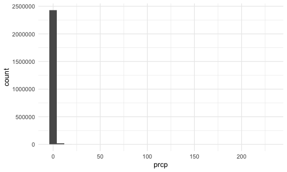
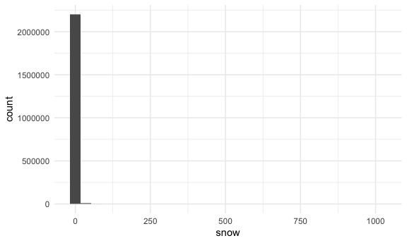
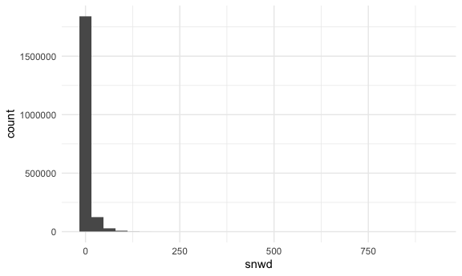

P8105 - HW3
================
Due: 2024-10-14

Author: Ravi Brenner (irb2118) \# Introduction This Rmarkdown document
is for P8105 - Data Science 1, homework 3, covering topics related to
visualization and exploratory data analysis.

# Methods

The NY NOAA data for this assignment comes from the `p8105.datasets`
package, which will be imported here along with the `tidyverse` package.
Additionally, some custom setup options are included here, based on
Dr. Goldsmith’s examples in class. Further datasets were downloaded from
the course website covering NHANES accelerometers and Citi Bike.

``` r
library(tidyverse)
library(p8105.datasets)

knitr::opts_chunk$set(
  fig.width = 6,
  fig.asp = .6,
  out.width = "90%"
)

theme_set(theme_minimal() + theme(legend.position = "bottom"))

options(
  ggplot2.continuous.colour = "viridis",
  ggplot2.continuous.fill = "viridis"
)

scale_colour_discrete = scale_colour_viridis_d
scale_fill_discrete = scale_fill_viridis_d
```

# Problems

## Problem 1

The goal is to do some exploration of this dataset. To that end, write a
short description of the dataset, noting the size and structure of the
data, describing some key variables, and indicating the extent to which
missing data is an issue. Then, do or answer the following (commenting
on the results of each):

Do some data cleaning. Create separate variables for year, month, and
day. Ensure observations for temperature, precipitation, and snowfall
are given in reasonable units. For snowfall, what are the most commonly
observed values? Why? Make a two-panel plot showing the average max
temperature in January and in July in each station across years. Is
there any observable / interpretable structure? Any outliers? Make a
two-panel plot showing (i) tmax vs tmin for the full dataset (note that
a scatterplot may not be the best option); and (ii) make a plot showing
the distribution of snowfall values greater than 0 and less than 100
separately by year.

The data comes from the `ny_noaa` dataset

``` r
data("ny_noaa")
```

This dataset shows daily weather data from 747 sites in New York State,
from 1981-01-01 to 2010-12-31

First, data cleaning. I will create separate variables for year, month,
and day. I also want to standardize the units of the precipitation and
snowfall variables. Per the course website, precipitation is given in
tenths of a mm, and snowfall and snow depth in mm. I will standardize
them all to cm, which is a more human-familiar measurement (even though
we live in the US!).

``` r
ny_noaa <- ny_noaa |>
  mutate(year = year(date),
         month = month(date),
         day = day(date),
         prcp = prcp / 100,
         snow = snow / 10,
         snwd = snwd / 10)
```

Taking a quick look at these values visually:

``` r
ny_noaa |>
  ggplot(aes(x = prcp)) + 
  geom_histogram()
```

    ## `stat_bin()` using `bins = 30`. Pick better value with `binwidth`.

    ## Warning: Removed 145838 rows containing non-finite outside the scale range
    ## (`stat_bin()`).



``` r
ny_noaa |>
  ggplot(aes(x = snow)) + 
  geom_histogram()
```

    ## `stat_bin()` using `bins = 30`. Pick better value with `binwidth`.

    ## Warning: Removed 381221 rows containing non-finite outside the scale range
    ## (`stat_bin()`).



``` r
ny_noaa |>
  ggplot(aes(x = snwd)) + 
  geom_histogram()
```

    ## `stat_bin()` using `bins = 30`. Pick better value with `binwidth`.

    ## Warning: Removed 591786 rows containing non-finite outside the scale range
    ## (`stat_bin()`).



These distributions are all extremely skewed, with 0cm of
precipitation/snowfall/snowdepth being by far the most

## Problem 2

## Problem 3

# Conclusion
