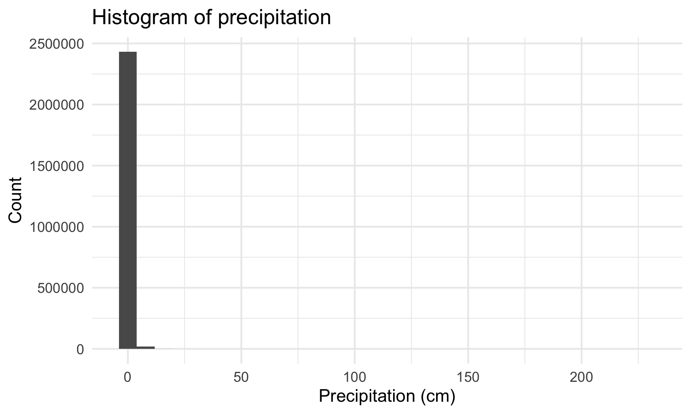
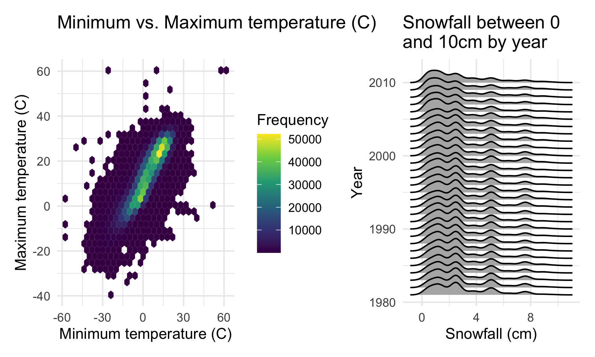
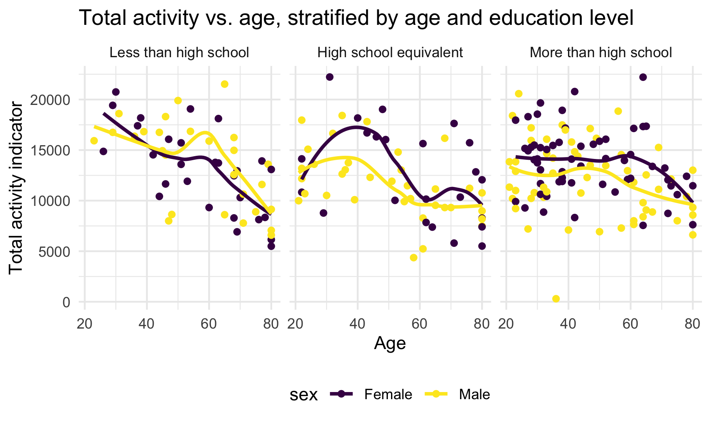

P8105 - HW3
================
Due: 2024-10-14

Author: Ravi Brenner (irb2118)

# Introduction

This Rmarkdown document is for P8105 - Data Science 1, homework 3,
covering topics related to visualization and exploratory data analysis.

# Methods

The NY NOAA data for this assignment comes from the `p8105.datasets`
package, which will be imported here along with the `tidyverse` package.
Additionally, some custom setup options are included here, based on
Dr. Goldsmith’s examples in class. Further datasets were downloaded from
the course website covering NHANES accelerometers and Citi Bike.

``` r
library(tidyverse)
library(p8105.datasets)
library(patchwork)

knitr::opts_chunk$set(
  fig.width = 6,
  fig.asp = .6,
  out.width = "90%",
  message = FALSE,
  warning = FALSE
)

theme_set(theme_minimal() + theme(legend.position = "bottom"))

options(
  ggplot2.continuous.colour = "viridis",
  ggplot2.continuous.fill = "viridis"
)

scale_colour_discrete = scale_colour_viridis_d
scale_fill_discrete = scale_fill_viridis_d
```

# Problems

## Problem 1

The data comes from the `ny_noaa` dataset

``` r
data("ny_noaa")

ny_noaa <- ny_noaa |>
  mutate(tmax = as.numeric(tmax),
         tmin = as.numeric(tmin))
```

This dataset shows daily weather data from 747 sites in New York State,
from 1981-01-01 to 2010-12-31. It has 2595176 and 7. Besides the
location id and date, it gives the amount of precipitation, snowfall,
snow depth, and the minimum and maximum temperature on each day. Even
though the dataset is quite large, there are many rows with missing
data: 43.7 percent of rows are missing temperature data, and there are
many rows missing precipitation and snowfall data as well. Additionally,
in the numeric columns, there are some extreme values. For example there
is at least one day with -13 mm of snowfall.

First, data cleaning. I will create separate variables for year, month,
and day. I also want to standardize the units of the precipitation and
snowfall variables. Per the course website, precipitation is given in
tenths of a mm, and snowfall and snow depth in mm. I will standardize
them all to cm, which is a more human-familiar measurement (even though
we live in the US!). Similarly for the temperatures, they are currently
in tenths of a degree celcius; I would rather they be degrees celcius.

``` r
ny_noaa <- ny_noaa |>
  mutate(year = year(date),
         month = month(date),
         day = day(date),
         prcp = prcp / 100,
         snow = snow / 10,
         snwd = snwd / 10,
         tmin = tmin / 10,
         tmax = tmax / 10)
```

Taking a quick look at these values visually:

``` r
ny_noaa |>
  ggplot(aes(x = prcp)) + 
  geom_histogram() + 
  labs(x = "Precipitation (cm)", y = "Count", title = "Histogram of precipitation")
```



``` r
ny_noaa |>
  ggplot(aes(x = snow)) + 
  geom_histogram() +
  labs(x = "Snowfall (cm)", y = "Count", title = "Histogram of snowfall")
```


``` r
ny_noaa |>
  ggplot(aes(x = snwd)) + 
  geom_histogram() +
  labs(x = "Snow depth (cm)", y = "Count", title = "Histogram of snow depth")
```


These distributions are all extremely skewed, with 0cm of
precipitation/snowfall/snowdepth being by far the most common amount.
This makes sense, since it (mostly) only snows in the winter, and rains
on a minority of days. We can see this more explicitly by constructing a
binary variable for “rain/no rain”

``` r
ny_noaa |> 
  mutate(rain_yn = case_when(prcp == 0 ~ 0,
                             prcp > 0 ~ 1,
                             .default = NA)) |>
  janitor::tabyl(rain_yn) |> 
  knitr::kable()
```

| rain_yn |       n |   percent | valid_percent |
|--------:|--------:|----------:|--------------:|
|       0 | 1471511 | 0.5670178 |     0.6007791 |
|       1 |  977827 | 0.3767864 |     0.3992209 |
|      NA |  145838 | 0.0561958 |            NA |

Here we can see that it rains on about 40% of days with recorded data.

Likewise with snowfall, it intuitively makes sense that smaller values
are going to be more common, since even when it snows, it is more likely
to be a light dusting than a multi-foot megastorm. We can see this by
filtering for snowfall \>0cm and looking at the plot again:

``` r
ny_noaa |>
  filter(snow > 0) |>
  ggplot(aes(x = snow)) + 
  geom_histogram() +
  labs(x = "Snowfall (cm)", y = "Count", title = "Histogram of snowfall > 0")
```


Very small values of snowfall remain the most common.

In terms of temperature, we can plot the average max temperature by
month at each station over the years. For ease of visualization, we’ll
consider just January and July, when it is coldest and hottest
(respectively) in NY:

``` r
ny_noaa |>
  group_by(id, year, month) |>
  summarize(avg_tmax = mean(tmax, na.rm = TRUE)) |>
  filter(month == 1 | month == 7) |>
  mutate(month = case_match(month, 
                            7 ~ "July",
                            1 ~ "January")) |>
  ggplot(aes(x = year, y = avg_tmax, group = year)) + 
  geom_point(color = "blue",alpha = 0.2) + 
  #geom_violin(alpha = 0.2) + 
  labs(x = "Year",
       y = "Average max temperature (C)",
       Title = "Average max temperature at each station in NY") +
  facet_wrap(. ~ month)
```


Because there are so many stations, its hard to detect a trend within
stations. However a few things are immediately clear:

- Average max temperatures in July are much higher than average max
  temperatures in January.

- Within each month, certain years stick out as warmer or colder across
  the sites. For example, January 1990 was quite warm, while July 2000
  was relatively cool.

- There are some extreme outliers, like on extra cold station in January
  1982, or in July 1988.

- The highest average max temperature recorded over July was in 2010.

We can also plot temperature and snowfall:

``` r
temp_hex_plot <- ny_noaa |>
  ggplot(aes(x = tmin, y = tmax)) + 
  geom_hex() +
  labs(x = "Minimum temperature (C)",
       y = "Maximum temperature (C)",
       fill = "Frequency",
       title = "Minimum vs. Maximum temperature (C)") + 
  theme(legend.position = "right")

snow_ridge_plot <- ny_noaa |>
  filter(snow > 0, 
         snow < 10) |>
  ggplot(aes(x = snow, y = year, group = year)) + 
  ggridges::geom_density_ridges() + 
  labs(y = "Year",
       x = "Snowfall (cm)",
       title = "Snowfall between 0 and 100cm by year")


temp_hex_plot + snow_ridge_plot
```



## Problem 2

This problem will use movement data from the NHANES study.

First, we will load, tidy, and merge the datasets. One dataset has
participant demographics, and the other has the accelerometer data. In
this process, I’ll also order any factor variables (like education) and
ensure that only participants \>=21 with complete demographic data are
included. The final dataframe is called `move_df`, since it is about
movement data.

``` r
demo_df <- read_csv("data/nhanes_covar.csv",
                    skip = 4,
                    show_col_types = FALSE) |>
  janitor::clean_names() |>
  mutate(sex = case_match(sex, 
                          1 ~ "Male",
                          2 ~ "Female",
                          .default = NA),
         education = case_match(education,
                                1 ~ "Less than high school",
                                2 ~ "High school equivalent",
                                3 ~ "More than high school",
                                .default = NA),
         education = factor(education, 
                            levels = c("Less than high school",
                                       "High school equivalent",
                                       "More than high school"))) |>
  filter(age >= 21) |>
  drop_na()

accel_df <- read_csv("data/nhanes_accel.csv",
                    show_col_types = FALSE) |>
  janitor::clean_names() |>
  pivot_longer(cols = min1:min1440,
               names_to = "minute",
               values_to = "mims",
               names_prefix = "min") |>
  mutate(minute = as.numeric(minute))

move_df <- demo_df |>
  left_join(accel_df, by = "seqn")
```

This final dataset has 328320 rows and 7 columns, with 228 participants
having full demographic data, and 1440 minutes recorded for each
participant. (228 \* 1440 = 328320).

We can evaluate the distribution of education among men and women. Here
are the counts:

``` r
move_df |>
  filter(minute == 1) |>
  group_by(sex,education) |>
  count() |>
  pivot_wider(names_from = sex,
              values_from = n) |>
  knitr::kable()
```

| education              | Female | Male |
|:-----------------------|-------:|-----:|
| Less than high school  |     28 |   27 |
| High school equivalent |     23 |   35 |
| More than high school  |     59 |   56 |

And here is a visualization of the age distributions for men and women
in each education category:

``` r
move_df |>
  filter(minute == 1) |>
  ggplot(aes(x = age, y = sex, fill = sex)) + 
  ggridges::geom_density_ridges() +
  facet_grid(education ~ .) +
  labs(y = "Sex",
       x = "Age in years",
       fill = "Sex",
       title = "Distribution of age for males and females by education category")
```


Overall, the number of males and females appears to be fairly balanced,
although there are more mails with high school equivalents than females.
Looking at the age distribution, it appears that, among those with high
school equivalents, there are relatively more younger males than
females.

Using the full dataset, we can sum across each participants total
activity in a day, to create a total activity indicator Then, we can
analyze how this total activity varies across age, sex, and education
level:

``` r
move_df |> 
  group_by(seqn, sex, age, bmi, education) |>
  summarize(total_activity = sum(mims)) |>
  ggplot(aes(x = age, y = total_activity)) + 
  geom_point(aes(color = sex)) +
  geom_smooth(color = "gray", 
              se = FALSE) + 
  labs(x = "Age",
       y = "Total activity indicator",
       title = "Total activity vs. age, stratified by age and education level") + 
  facet_grid(sex ~ education) 
```



From this plot, it’s clear that total activity tends to decline with
age, although the rate and degree of this decline can vary with sex and
education level. The rate of decline appears to be lower among those
with more education compared to those with less education. The
differences between men and women are more subtle and harder to discern
from a single plot, however it appears that females generally have
higher total activity levels than men.

Next we can look at how activity levels vary over the course of the day:

``` r
move_df |>
  group_by(education, sex, minute) |>
  summarize(avg_mims = mean(mims)) |>
  ggplot(aes(x = minute, y = avg_mims, color = sex)) + 
  geom_point(alpha = 0.2) + 
  geom_smooth(se = FALSE) +
  scale_fill_manual(values = c("red","black")) +
  facet_grid(. ~ education) + 
  labs(x = "Minute of day",
       y = "Average activity score",
       color = "Sex",
       title = "Average activity score during the day by education level and sex")
```


Based on these graphs, we can make a few observations

- Differences in activity across education levels appear mostly during
  the daytime. Everyone’s activity dips to a similar low level during
  the night.

- Similarly, differences in activity levels among males and females are
  most pronounced during the daytime, when females tend to be more
  active than males. At nighttime though, it appears that males are
  slightly more active, particularly those with less than high school
  education.

- Activity levels for those with less than high school education reach a
  peak and then decline, whereas those with more education reach a
  plateau during the day before declining at night.

## Problem 3

# Conclusion
